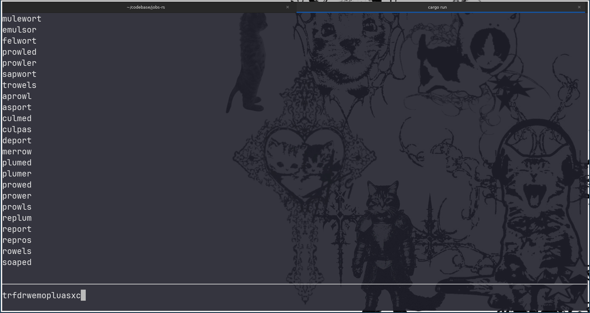

## A TUI Word Hunt solver written in Rust 

#### About
Well, it's another find-words-in-matrix-from-dictionary-with-trie, but it's my first TUI application!  

The goal of this project was to suprise my beautiful, amazing, and smart girlfriend with my newfound Word Hunting abilities.  

Some things to consider here are that it takes about 10-15 seconds to read the Word Hunt grid and type it into the terminal which is about a 15-20% time redution from the alloted playtime. After 4 games (my girlfriend is busy watching drag race), my best score was 12400; a new high from my previous PR of ~10000.  
Right now, the application only displays the amount of words equal to the terminal height - 3, but I've found this is more than enough given the time limit. I've also come to find that the dictionary I used includes english words that aren't valid in the game ¯\_(ツ)_/¯  

#### crossterm
[crossterm](https://crates.io/crates/crossterm) is a Rust library that provides an API to easily manipulate the terminal interface. It supports a majority of UNIX and Windows terminals down to Windows 7 and worked perfectly on my Ghostty terminal in Linux Mint!  

#### fxhash
[fxhash](https://crates.io/crates/fxhash/) is a hashing algorithm that operates faster than the standard Rust hash library by hashing at 8 bytes a time rather than one on x64 platforms. It was extracted from the Rustc compiler, but Rust doesn't add it to the stdlib for whatever reason.
